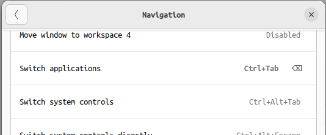
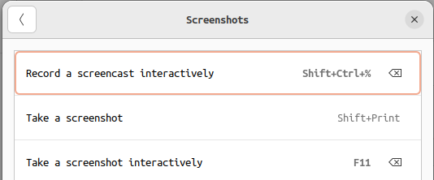
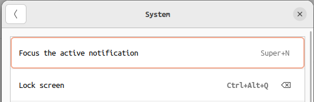
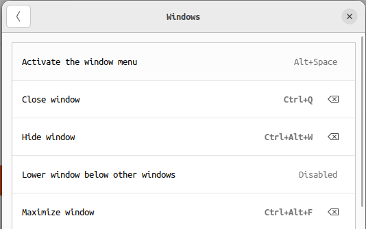
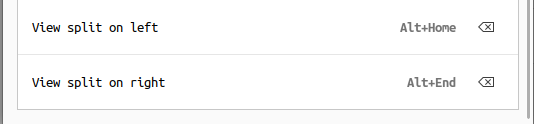

# 우분투 세팅

## 한글
- 기본 ibus 사용
- [참고](https://basiclike.tistory.com/169)

## 카카오톡 설치
- [bottles 사용해 설치](https://usebottles.com/)

## 키 설정
- [keyd 설치](https://github.com/rvaiya/keyd)
- 세팅 파일 참고 (/keyd)
    - 위치 : /etc/keyd/default.conf
- 기본 세팅

## launcher
- [ulauncher](https://ulauncher.io/#Download)
- extension 목록
    - [vscode launcher](https://ext.ulauncher.io/-/github-alchemistake-git_code_launch)
    - [intellij launcher](https://github.com/zakuciael/ulauncher-jetbrains-reloaded) : python requirements.txt 설치, jetbrains toolbox 설치, shell script 생성(~/.local/bin) 필요
    - [process killer](https://github.com/Ulauncher/ulauncher-kill)
    - [system manager](https://github.com/lighttigerXIV/ulauncher-session-manager)